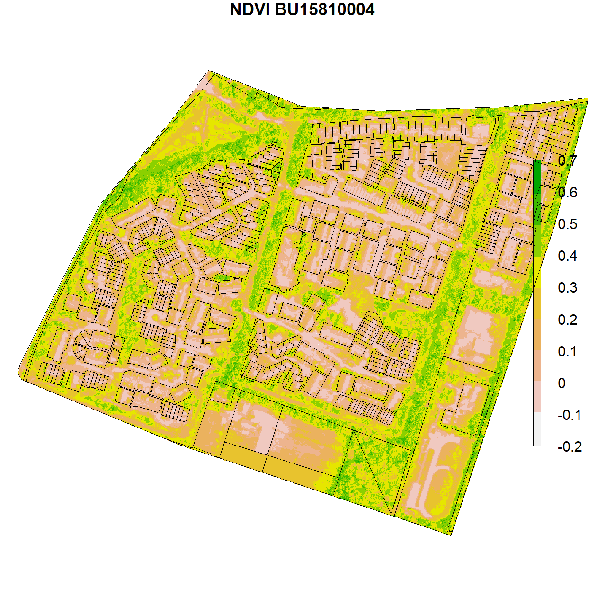
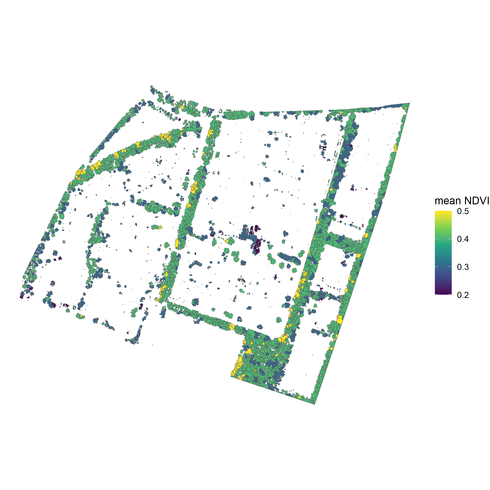

# Remote Sensing of green (private) urban spaces

This repository contains the R-code for detecting vegetation, trees and tree crowns in neighbourhoods and private gardens. Vegetation detection is based on Color-infrared (CIR) aerial imagery and the NDVI vegetation metric. Individual tree-crown delineation and treetop detection is supported by airborne LiDAR data.

## Open Data 
The procedure generates insights based on open data:
- PDOK, nationaalgeoregister.nl (vector data)
- Aerial photo, opendata.beeldmateriaal.nl (raster data)
- Actueel Hoogtebestand Nederland (AHN) (raster data) 

## Methodology
More information is available in the [presentation slides](https://datasciencevng.nl/s/fp97uFYyVmACYZuB)

## Structure of the procedure

```
├── LICENSE
├── README.md         				 <- README
├── R
	│
	├── 00_init_batch_run.R  	 	 <- run procedure
	│
	├── 01_RemoteSensing_NDVI    <- main procedure
	│
	├── AI				  			<- input (aerial image)
	│
	├── DATA			  			<- output (TIFF, geopackages)
	│
	├── REPORT            <- output (metrics)
	│
	├── PLOTS             <- output (visualisations) 
	│	
	├── SRC               <- dedicated procedures
	│
	├── FUNC 							<- functions
	│
	├── report_remote_sensing_NDVI.Rmd 	<- report template
	

```

## Output
Geopackages:
The R procedure result in geopackage (gpkg) files with multiples layers containing the results of the analysis. The geopackages can be deployed in QGIS or similar (commercial) GIS-software. 

Plots:
Green Indices: NDVI TNDVI, RVI, MSAVI2, EVI2 
Calculations: unsupervised classification of NDVI, principal component analysis of aerial photo, canopy height model, tree tops, tree crowns, tree health

Metrics:
see: metrics_definition.txt 
all metrics are stored in sheets in the REPORT directory.




## Instructions
Open de Rproj-file in the R-directory to start the environment. Define the neighbourhood code(s) and municipality name in the neighbourhood.xlsx file. 

You may either use your own color infrared (CIR) aerial photo (must include infrared-band) or extract the area from the main  aerial photo of the Netherlands*. You may use tif or ecw as file-format. Make sure the aerial photo covers the neighbourhoods.  

Please verify and adjust settings in '00_init_batch_run.R'
 
Run the procedure via '00_init_batch_run.R'

Output is served to DATA-directory (geopackages), PLOTS-directory (images) and REPORT-directory (xls-sheets)

*)
https://datasciencevng.nl/s/ztnYabpulASJakHR (119GB), photo 2020 (early summer)

## Requirements
Hardware : CPU I7 (or similar processor), minimal 16GB RAM (32GB for larger areas like municipalities)

QGIS
https://www.qgis.org/en/

GEOS, GDAL, PROJ.4 (included when installing QGIS)

R : 
R 4.0<
Rstudio 1.2.5<, 
Rtools 4<
https://cran.r-project.org/bin/windows/Rtools/
update Rccp-package 

For development : Git and Gitlab
Repo : https://gitlab.com/datasciencehub/remote-sensing.git

## Issue reporting
Report issues via:
https://gitlab.com/datasciencehub/remote-sensing/-/issues

## Contact
For technical assistance and other questions, please contact
Mark Gremmen, mark.gremmen@vng.nl (project, R language).

## Expertise group data science
This procedure is a joined effort of VNG, several dutch municipalities and public organisations, including: Amsterdam, Apeldoorn, Utrecht, Omgevingsdienst Midden- en West Brabant, and GGD West Brabant

## Licence
<a rel="license" href="http://creativecommons.org/licenses/by-nc-sa/4.0/"></a><br />Dit werk valt onder een <a rel="license" href="http://creativecommons.org/licenses/by-nc-sa/4.0/">Creative Commons Naamsvermelding-NietCommercieel-GelijkDelen 4.0 Internationaal-licentie</a>.

